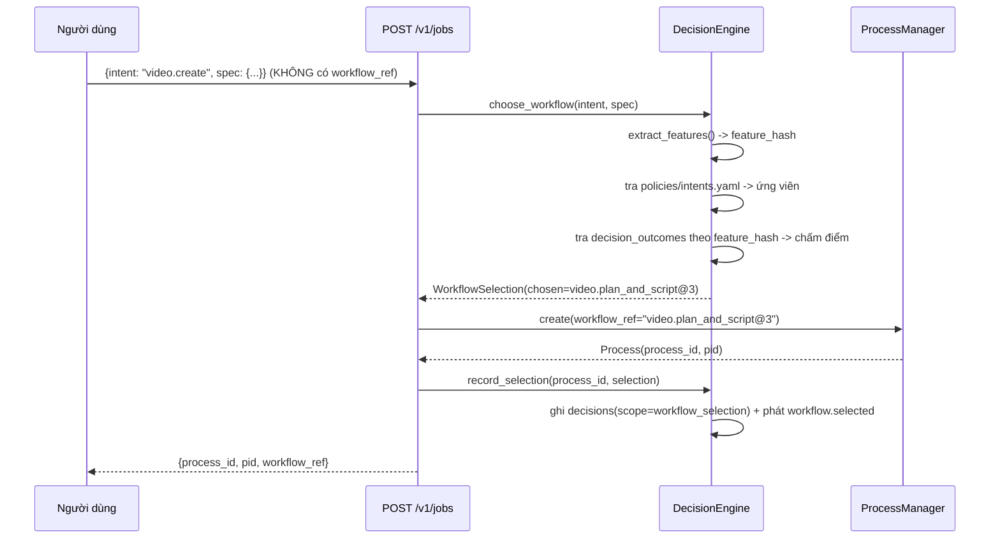
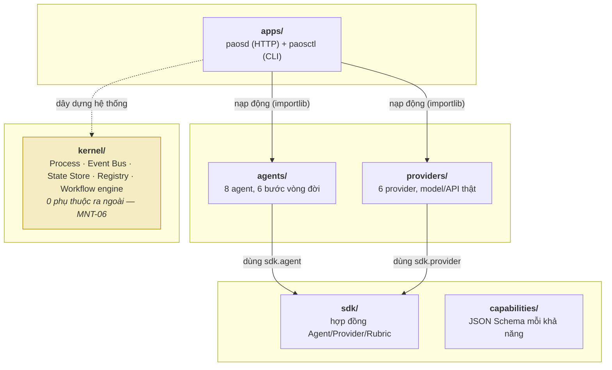
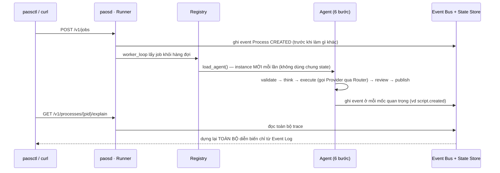
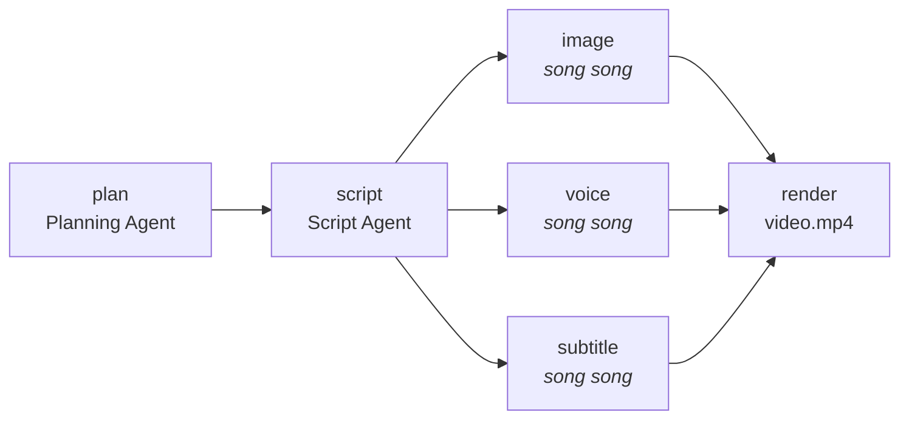
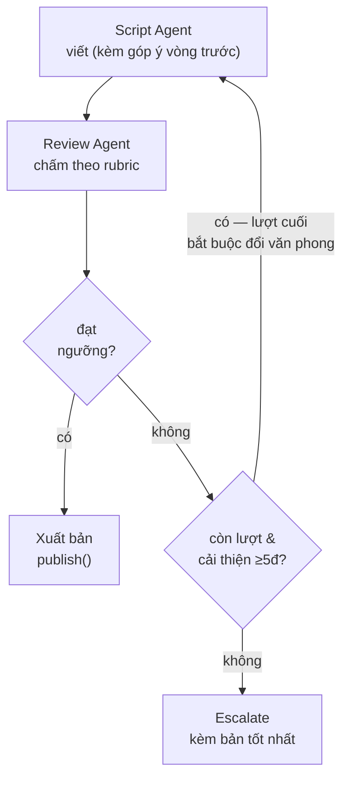

# Hướng dẫn sử dụng & Luồng dự án

> Tài liệu SỐNG — cập nhật mỗi khi có chức năng mới (P-CLOSE của mỗi lát cắt), không phải ảnh chụp một lần. Khác với `docs/00-20` (đặc tả thiết kế, ổn định), file này mô tả **thực trạng chạy được hôm nay**, cùng nhóm với `docs/backlog.md`/`docs/environment-baseline.md`. Cập nhật gần nhất: lát cắt **P-M5-4** (2026-08-16) — Privacy Filter: `Router.call(..., contains_private_l3=True)` chặn vô điều kiện mọi provider `class: cloud` (kiểm bằng test đối kháng), `paosctl memory forget` (xóa cứng thật, ADR-0029) + `export`/`import` JSON. **Đóng phạm vi lát cắt Milestone 5** (P-M5-0 → P-M5-4).

---

## Tài liệu 1 — Hướng dẫn sử dụng hệ thống

PAOS là một "hệ điều hành AI cá nhân" chạy trên máy của chính bạn (local-first) — nhận yêu cầu bằng ngôn ngữ tự nhiên/API, tự lên kế hoạch, tự gọi đúng công cụ (LLM, tạo ảnh, giọng nói...), tự chấm điểm kết quả, và luôn giải thích được vì sao nó quyết định như vậy.

### 1.1 Cài đặt & khởi động

```bash
pip install -e ".[dev]"   # 1 lần, cài paosd/paosctl vào PATH
```

```bash
# Terminal 1 — chạy daemon nền, cổng 127.0.0.1:8787
paosd

# Terminal 2 — kiểm tra + dùng thử
paosctl doctor
# ✓ paosd OK tại http://127.0.0.1:8787
```

### 1.2 Những gì dùng được hôm nay

**Tóm tắt văn bản**
```bash
paosctl run "Dán văn bản cần tóm tắt vào đây..."
paosctl explain 1001   # xem lại toàn bộ diễn biến
```

**Sản xuất video ngắn từ 1 câu chủ đề (UC1)** — từ 1 câu chủ đề → tự lên dàn ý → viết lời thoại → tạo ảnh minh hoạ + giọng đọc + phụ đề (chạy song song) → ghép thành video. Đo được tiết kiệm thời gian nhờ chạy song song, tự chuyển "chế độ nhẹ" khi máy không có GPU thay vì crash (LOC-05).
```bash
curl -X POST localhost:8787/v1/jobs -d '{"intent":"video","spec":{"text":"MongoDB là gì"},"workflow_ref":"workflow:video.plan_and_script@3"}'
```

**Tự chấm điểm & tự sửa kịch bản trước khi dùng (mới — M4)** — kịch bản được chấm theo rubric (đúng độ dài, không lặp ý, mở đầu cuốn hút, đúng tone, có kêu gọi hành động...). Điểm thấp → tự viết lại kèm góp ý, tối đa 3 lần, lần cuối bắt buộc đổi văn phong. Vẫn không đạt → báo người dùng kèm bản tốt nhất, không bao giờ trả tay trắng.
```bash
curl -X POST localhost:8787/v1/jobs -d '{"intent":"video","spec":{"plan":"..."},"workflow_ref":"workflow:script_with_review@1"}'
```

**Ghi lại khi bạn tự tay sửa kết quả AI (mới — M4)** — chỉ số đáng tin nhất theo doc 08 §5 không phải điểm rubric, mà là bạn phải sửa tay BAO NHIÊU. Sửa xong, nộp lại để hệ thống đo `edit_rate` khách quan (không tự khai).
```bash
paosctl artifact show <artifact_id>              # xem nội dung, tự sửa trong editor riêng
paosctl artifact edit <artifact_id> ban-da-sua.txt  # nộp lại — in ra edit_rate đo được
```

**So sánh chất lượng prompt/provider theo thời gian (mới — M4)** — chạy bộ mẫu chuẩn qua nhiều phiên bản prompt, xuất bảng so sánh điểm/edit_rate/chi phí/độ trễ, tự chặn nếu chất lượng đi xuống trước khi đổi prompt thật (doc 08 §7.5).
```bash
python scripts/run_eval.py --provider ollama   # cần Ollama đang chạy; --provider stub để chỉ thử hạ tầng offline
```

**Tìm lại ký ức đã lưu (mới — M5)** — truy hồi lai: khớp đúng theo key trước (nhanh, tất định), rồi mới tới tìm theo ngữ nghĩa (vector, ngưỡng cosine ≥ 0.62), ưu tiên ký ức dùng gần đây (doc 07 §3).
```bash
paosctl memory list L3                              # duyệt thô theo tầng (L0-L4)
paosctl memory search "tone chuyên nghiệp" --tier L3  # truy hồi lai, xếp hạng theo điểm
```

**PAOS tự học sở thích từ hành vi quan sát được (mới — M5)** — mỗi job có `spec.duration_sec`/`tone`/`voice` được quan sát tự động (doc 07 §2.1): quan sát lặp lại → `confidence` tăng dần; sửa tay artifact sinh ra từ job đó → `confidence` giảm ngay (tín hiệu khách quan, không tự khai). Xem trạng thái từng sở thích (đang tự áp dụng / chỉ gợi ý / còn quá yếu):
```bash
paosctl memory review           # gộp theo trạng thái áp dụng, tầng L3 mặc định
```

**Knowledge Graph cá nhân tự lớn dần theo mỗi job (mới — M5)** — mỗi kịch bản/dàn ý/tóm tắt sinh ra được quét qua danh sách thuật ngữ đã biết (MongoDB, Docker, Database...), tạo/củng cố node + gắn cạnh `learned_from` về artifact nguồn — mọi cạnh đều truy được "vì sao PAOS biết cái này" (doc 07 §4.4). `paosctl memory search` giờ tự dùng KG này (bước 2, "KG walk 2-hop") khi câu hỏi nhắc tới một entity đã biết, không chỉ vector search.
```bash
paosctl knowledge list --type Technology     # duyệt node theo loại
paosctl knowledge show <node_id>             # 1 node kèm mọi cạnh — provenance đầy đủ
paosctl knowledge export                     # xuất knowledge/graph.jsonld (thủ công, doc 07 §4.4)
```

**Quyền riêng tư: memory L3 không rời máy, và nút quên (mới — M5)** — mọi lượt gọi capability có đánh dấu "mang Memory L3 riêng tư" bị chặn tuyệt đối nếu provider đích là `class: cloud`, bất kể provider tự khai `privacy:` gì (chống provider khai gian/cấu hình sai). "Quên" 1 ký ức là xóa cứng thật, không qua Trash, không khôi phục được (ADR-0029 — ngoại lệ có chủ đích với chính sách xóa mềm chung).
```bash
paosctl memory show <memory_id>       # xem chi tiết 1 ký ức trước khi quyết định
paosctl memory forget <memory_id>     # XÓA VĨNH VIỄN — hỏi xác nhận, --yes để bỏ qua
paosctl memory export                 # xuất toàn bộ memory ra JSON để tự soi
paosctl memory import ban-da-sua.json # nhập lại (đã tự sửa tay) — upsert theo memory_id
```

**Decision Engine tự chọn workflow từ ý định (mới — M6)** — bỏ `workflow_ref` đi, chỉ nêu `intent`: đặc trưng hóa JobSpec (thuần tất định, không LLM) → tra ứng viên theo `policies/intents.yaml` → chấm điểm theo tỉ lệ thành công quá khứ (`decision_outcomes`, cold start → thứ tự khai báo). Ghi Decision Record + phát `workflow.selected`, xem lại qua `paosctl explain`.
```bash
curl -X POST localhost:8787/v1/jobs -d '{"intent":"video.create","name":"demo","spec":{"inputs":[{"type":"text"}]}}'
# response trả lại workflow_ref đã CHỌN, không phải bạn tự khai
```

**Router tự xếp hạng provider theo lịch sử chất lượng thật + hồ sơ ưu tiên (mới — M6)** — mỗi lượt gọi capability đều ghi vào `provider_stats` (thành công/thất bại tức thời + EWMA điểm rubric theo `task_class`, α=0.2). Sau khi 1 provider có ≥5 quan sát chất lượng, Router chấm điểm theo `w_q·Q̂ + w_p·P + w_r·R` — trọng số đọc từ `policies/routing.yaml`, sửa file có hiệu lực ngay lần gọi kế tiếp (hot reload, không cần khởi động lại `paosd`). 3 hồ sơ sẵn có: `economy` (ưu tiên rẻ), `quality` (ưu tiên điểm cao), `private` (ưu tiên chạy local). Sửa tay 1 artifact do AI sinh ra phạt nặng gấp 3 lần provider đã sinh ra nó (`quality.artifact.edited`).
```bash
paosctl explain <pid> --decisions   # xem lại rationale: vì sao provider này được chọn
```

**Ngân sách 3 tầng — không bao giờ âm thầm tiêu tiền (mới — M7)** — mỗi lượt gọi capability được ước lượng chi phí (`estimate()`, đã có sẵn từ M2) TRƯỚC khi chạy, so với ngân sách `per_job/per_day/per_month` (`policies/budget.yaml`). Vượt tầng `per_job` (mặc định `on_exceed: ask`) → **chặn ngay**, đi qua Permission Guard (audit_log + `permission.approval.requested`) — không thử provider khác, không tự ý chi thêm (P12). Vượt tầng `per_day`/`per_month` (`force_local`/`block_cloud`) → chỉ loại provider cloud khỏi ứng viên, tự chuyển sang local. Sau khi gọi thành công, chi phí THẬT (từ `usage` provider trả về) được ghi vào `cost_entries`. Chi tiêu hôm nay vượt `warn_at_pct` → Router tự chuyển sang hồ sơ `economy`.
```bash
# provider.yaml::cost hôm nay đều 0đ (chưa có provider cloud thật) — xem
# cost_entries qua sqlite3 workspace/.paos/state.db "select * from cost_entries"
```

**Không chạy khi máy đang bận thật (mới — M7)** — mỗi lượt gọi capability được kiểm CPU/pin thật (`psutil`, ADR-0030) trước khi chạy, không chỉ đếm số Task nội bộ paosd đang giữ token. CPU >75% (`policies/energy.yaml`) hoặc đang dùng pin mà capability không nằm trong danh sách cho phép → loại, phát `resource.wait.started`, thử lại sau (qua backoff đã có — không chạy đè máy). Nhiệt độ CHƯA đo được trên Windows (giới hạn nền tảng thật, không giả vờ có số); GPU util/VRAM khai báo trong policy nhưng chưa đọc (tránh phụ thuộc thư viện riêng NVIDIA).
```bash
paosctl explain <pid> --decisions   # candidate bị loại vì máy bận hiện với lý do "ENERGY_CPU_OVERLOADED:0.9x"
```

**Không render khi đang giờ làm việc (mới — M7)** — mỗi lượt gọi capability được kiểm cửa sổ thời gian (`policies/time.yaml`) trước khi chạy. Trong cửa sổ `allow_heavy: false` (mặc định `work_hours` mon-fri 08:00-18:00, giờ UTC — không quy đổi timezone local, ADR-0031), capability không nằm trong allowlist của cửa sổ đó bị loại, phát `time.window.blocked`, thử lại sau qua backoff đã có (không chạy đè). Ngoài cửa sổ đó (hoặc `default`) → chạy bình thường. `max_parallel` khai báo trong policy nhưng CHƯA enforce; `deadline` miễn trừ (doc 06 §5) CHƯA làm (BL-024).
```bash
paosctl explain <pid> --decisions   # candidate bị loại vì ngoài giờ hiện với lý do "TIME_WINDOW_BLOCKED:work_hours"
```

**Báo cáo tháng — đã tiêu bao nhiêu, tiết kiệm bao nhiêu (mới — M7)** — mỗi cache hit (tránh gọi lại provider) và mỗi lần chọn candidate local trong khi có candidate cloud/hybrid đủ điều kiện đều ghi số tiền THẬT tránh được (`adapter.estimate()` trên provider bị tránh, không suy diễn giá trung bình, ADR-0031) vào `savings_entries`.
```bash
paosctl report                      # tháng hiện tại: đã tiêu / tiết kiệm cache / tiết kiệm local
paosctl report --month 2026-08      # chọn tháng khác
# saved_local hôm nay luôn 0đ — repo chưa đăng ký provider cloud/hybrid nào thật (ADR-0031)
```

**Theo dõi & giải thích mọi việc đang/đã làm** — không có "log" mù mờ, mọi quyết định dựng lại được đầy đủ từ Event Log.
```bash
paosctl ps                 # liệt kê mọi job
paosctl status <pid>       # trạng thái hiện tại
paosctl explain <pid>      # toàn bộ diễn biến, theo thứ tự thời gian
paosctl explain <pid> --decisions  # kèm Decision Record — candidate nào, vì sao chọn (P-M6-3)
paosctl cancel <pid>       # hủy 1 job đang chạy, không ảnh hưởng job khác
```

### 1.3 Giới hạn hiện tại — nói thẳng

- **Chưa có giao diện Web/đồ hoạ** (đó là M8). Dùng qua `paosctl` hoặc HTTP trực tiếp; có Swagger UI tự sinh ở `http://127.0.0.1:8787/docs` để thử API không cần viết code.
- **Model LLM thật (Ollama) chưa bật an toàn** — mặc định dùng provider "giả lập xác định" (`stub.deterministic`) để mọi thứ chạy nhanh, offline, kiểm chứng được (xem `docs/backlog.md` BL-004). Kết quả sinh ra hiện KHÔNG phải văn bản do AI thật viết.
- **Cơ chế tự sửa kịch bản (M4) chưa nối vào luồng sản xuất video thật** — mới chạy ở 1 luồng riêng (`workflows/script_with_review/`) để chứng minh cơ chế đúng, chưa thay bước viết kịch bản trong UC1 (BL-009).
- **Eval harness (M4) mới có bộ mẫu nhỏ (6 mẫu)**, chưa phải quy mô 30-50 mẫu đầy đủ (BL-011); `scripts/run_eval.py` cũng chưa cưỡng chế "judge khác provider generator" như luồng production (BL-010).
- **Học được nhưng chưa AI nào dùng lại** — `MemoryWriter` tự học sở thích thật (P-M5-2), nhưng chưa Agent nào (`PlanningAgent`, `ScriptAgent`...) đọc lại để áp dụng — "học" xong, chưa "dùng" (BL-015). Sửa tay hạ confidence ở MỨC CẢ JOB, chưa phân biệt được trường nào sai (BL-016).
- **Knowledge Graph chỉ nhận diện thuật ngữ có trong danh sách đã biết** (~40 mục, `sdk/kg_extract.py::KNOWN_TERMS`) — không phải NLU/LLM thật (quyết định có chủ đích, ADR-0028, để giữ tính TẤT ĐỊNH cần cho "rebuild từ replay"); bỏ sót thuật ngữ chưa có trong danh sách (BL-017). Quan hệ suy ra được CHỈ có `learned_from` (entity → artifact nguồn) — chưa suy luận `is_a`/`alternative_to` giữa các entity. Cơ chế phát hiện mâu thuẫn đã xây và kiểm thật nhưng chưa có đường trích `prefers`/`avoids` thật để kích hoạt (BL-018). Số node tích luỹ từ sử dụng thật còn ít — cần dùng PAOS qua thời gian, không phải thứ 1 lát cắt code tạo ra được.
- **Privacy Filter chưa có caller thật nào bật cờ** — `contains_private_l3=True` CHẶN THẬT (kiểm bằng test đối kháng), nhưng chưa Agent nào đọc lại Memory L3 để cần dùng cờ này (BL-015/BL-019) — hạ tầng sẵn sàng, chờ caller thật. Cũng chưa có provider `class: cloud` THẬT nào trong `providers/` để thử nghiệm ngoài môi trường test.
- `paosctl knowledge` không có lệnh `forget` (quyết định có chủ đích — doc 07 §4.4 nói KG không bao giờ xóa, dùng `invalidated_at`; xem ADR-0029, BL-020).
- **`policies/intents.yaml` mới có đúng 1 intent thật** (`video.create`) — chưa có 2 workflow cạnh tranh thật để Decision Engine chấm điểm phân biệt ngoài test (P-M6-1).
- **Router xếp hạng được 3/5 số hạng (Q̂/P/R) — chưa dùng Ĉ để CHẤM ĐIỂM** (CostEngine đã CHẶN vượt ngân sách, nhưng `_rank_candidates()` chưa đưa chi phí vào công thức xếp hạng — 2 việc khác nhau: "được phép gọi không" vs "gọi ai tốt hơn"). L̂ (latency) vẫn chưa track. `provider_stats`/`cost_entries` hôm nay chỉ có provider local/stub trong test — chưa provider `class: cloud` thật nào (mọi `cost:` hôm nay đều 0đ) để thấy ngân sách/ranking đổi hành vi thật ngoài môi trường test.
- **Ước lượng ngân sách chỉ per-CALL, chưa per-JOB** (mốc 1 doc 06 §3.2 "ước lượng tổng trước khi chạy" — chưa làm, cần duyệt DAG với input các bước sau CHƯA resolve lúc Job mới tạo, vấn đề riêng).
- **PermissionGuard CONFIRM chưa có luồng chờ người duyệt thật** — `cost.budget_exceeded` (như 2 action CONFIRM khác từ M2-5) trả "pending" ngay, chưa có `paosctl` hỏi xác nhận / hết hạn 24h — đang HOÃN từ M2-5, chưa milestone nào nhận (BL-021, `docs/backlog.md`).
- **Energy Engine chưa chuyển Process sang WAITING/resume thật** — chỉ loại candidate + để cơ chế fallback/backoff đã có xử lý (BL-022). GPU util/VRAM chưa đọc (tránh vendor lock-in NVIDIA, ADR-0030), nhiệt độ không đo được trên Windows (giới hạn nền tảng thật của `psutil`, không phải bỏ sót).
- **Time Engine chưa có `deadline` miễn trừ, `max_parallel` chưa enforce, giờ UTC trực tiếp (không quy đổi timezone local)** — cùng lý do Energy Engine ở trên (chưa chuyển Process sang WAITING thật, chỉ loại candidate + backoff), 3 quyết định phạm vi có chủ đích (ADR-0031, BL-024).
- **Savings Report "tiết kiệm nhờ local" luôn 0đ** — repo hôm nay chưa đăng ký provider `class: cloud`/`hybrid` nào thật, nên không có gì để so sánh (không phải bug, ADR-0031). "Tiết kiệm nhờ cache" đã đo được thật ngay khi có cache hit.

### 1.3b Ví dụ minh hoạ — Decision Engine chọn workflow



### 1.4 Sắp tới

P-M8-0 vừa xong — chốt 2 ADR mở đầu Milestone 8 (chưa viết code, đúng bản chất P-M8-0 "quyết định trước"). **ADR-0017**: UI v1 là Web local tĩnh — HTML/CSS/JS thuần, không framework/build step, phục vụ bởi chính `apps/paosd/app.py` cùng port `127.0.0.1:8787` đã có (không Tauri — mâu thuẫn với doc 02 §8 đã sketch từ Ngày 0, và máy dev chưa có toolchain Rust). **ADR-0018**: plugin phân phối dạng thư mục thuần (đường dẫn local hoặc git URL, không archive), cài vào `workspace/plugins/<id>/` (không phải gốc repo — giữ đúng ranh giới "workspace = dữ liệu người dùng"), Registry quét thêm 1 gốc `plugins_dir` tái dùng nguyên các hàm scan đã có. Việc **ngay tiếp theo**: **P-M8-1 — Plugin loader + sandbox subprocess (JSON-RPC stdio)**, hiện thực hóa ADR-0005/ADR-0018. Lộ trình đầy đủ ở [§3](#3-lộ-trình-sắp-tới) bên dưới.

---

## Tài liệu 2 — Luồng dự án: kiến trúc & sơ đồ

4 sơ đồ dưới trả lời: hệ thống chia tầng ra sao, 1 yêu cầu đi qua đâu, video được ráp bằng DAG nào, và kịch bản tự sửa lặp thế nào. Vẽ đúng cơ chế thật trong code.

**4 nguyên tắc chi phối mọi sơ đồ dưới đây** (doc 00 §5):
- **P1** — Kernel không biết gì về AI: không 1 từ "prompt"/"model" nào trong `kernel/`.
- **P3** — Capability trước Provider: Agent chỉ biết "cần khả năng gì", không biết ai phục vụ.
- **P4** — Mọi thứ liên lạc qua Event: không tầng nào gọi thẳng tầng khác để "biết kết quả".
- **P5** — Explainable by default: Event Log là nguồn sự thật DUY NHẤT.

### 2.1 Sơ đồ 1 — Kiến trúc 4 tầng

Tầng trên được phép "biết" tầng dưới, không bao giờ ngược lại — cưỡng chế thật bằng CI (`import-linter`, `.importlinter`), không phải quy ước suông.



Agent/Provider mới thêm vào chỉ cần 1 file + 1 YAML, `kernel/` nạp động qua `importlib`, không sửa code tầng trên.

### 2.2 Sơ đồ 2 — 1 yêu cầu đi qua hệ thống như thế nào

Mọi bước đều ghi Event TRƯỚC KHI làm bước tiếp theo — kể cả nếu tắt máy giữa chừng, khởi động lại không mất dấu (P9 idempotent & resumable).



### 2.3 Sơ đồ 3 — DAG sản xuất video (UC1)

3 nhánh giữa chạy THẬT SỰ song song (không phải giả lập) — `explain` đo và ghi lại số mili-giây tiết kiệm được so với chạy tuần tự.



Thêm Subtitle Agent (nhánh thứ 3) vào sau không sửa 1 dòng nào của Planning/Script Agent đã có — bằng chứng P4 (loose coupling), kiểm bằng diff git thật (P-M3-4).

### 2.4 Sơ đồ 4 — Vòng lặp tự sửa kịch bản (M4)

Đúng 5 quy tắc chống lặp vô ích (doc 08 §4): tối đa 3 lần thử, phải cải thiện ≥5 điểm giữa 2 vòng liền nhau (không thì dừng sớm), lần cuối bắt buộc đổi văn phong, luôn escalate kèm bản tốt nhất.



Judge (Review Agent) luôn bị cưỡng chế dùng provider KHÁC provider đã viết kịch bản (`Router.call(..., exclude_provider=...)`) — chống việc model tự khen bài của chính nó (ADR-0008, RSK-10).

### 2.5 Vì sao mọi thứ đều là Event

Event Bus không phải chi tiết kỹ thuật phụ — nó LÀ xương sống. Process, Task, Agent, Provider, Router đều chỉ giao tiếp bằng cách **ghi 1 sự kiện** (vd `script.created`, `quality.review.rejected`) rồi để bên khác tự đọc, không gọi thẳng nhau chờ kết quả. Hệ quả trực tiếp: tắt máy giữa chừng khởi động lại không mất dấu vết (đã kiểm bằng test `kill -9`), và `explain` luôn giải thích được MỌI quyết định mà không cần thêm 1 dòng code logging nào — vì bản thân quyết định ĐÃ LÀ 1 event.

---

## 3. Lộ trình sắp tới

Theo kế hoạch 10 milestone (~31 tuần lập trình thuần, 11–15 tháng làm bán thời gian, [doc 13](13-roadmap-and-milestones.md)). Mỗi milestone đều phải cho ra thứ CHẠY ĐƯỢC thật, không có milestone nào chỉ "xây hạ tầng".

| # | Tên | Kết quả dùng được | Trạng thái |
|---|---|---|---|
| M0 | Walking Skeleton | Chạy 1 job đơn giản end-to-end | ✅ Xong |
| M1 | Kernel thật | Process quản lý được, resume được | ✅ Xong |
| M2 | Capability & Provider | Đổi provider không sửa code | ✅ Xong |
| M3 | Agent & Workflow | Video plugin chạy hoàn chỉnh | ✅ Xong |
| M4 | Quality & Self-Correction | Tự sửa, tự chấm điểm, ghi `edit_rate` | ✅ Xong |
| M5 | Memory & Knowledge | Nhớ sở thích, xây Knowledge Graph | ✅ Phạm vi xong · 2/5 tiêu chí trọn vẹn |
| M6 | Decision Engine | Tự chọn workflow phù hợp | ✅ Phạm vi xong — chọn workflow + xếp hạng provider (Q̂/P/R) + routing.yaml/profile + explain --decisions. Chờ M7 (Ĉ/L̂) mới đủ 5/5 số hạng |
| M7 | Cost / Energy / Time | Chạy đêm, tiết kiệm, đúng ngân sách | ✅ Xong — Cost Engine (ngân sách 3 tầng) + Energy Engine (CPU/pin thật) + Time Engine (cửa sổ thời gian) + Savings Report (`paosctl report`) |
| M8 | Plugin System & UI | Cài plugin, có giao diện Web thật | 🔶 Đang làm — P-M8-0 xong (ADR-0017 UI Web local tĩnh, ADR-0018 phân phối plugin) |
| M9 | Research Plugin | Nghiên cứu chủ đề, tích luỹ tri thức thật | ⚪ Chưa tới |
| — | Hardening | Đạt toàn bộ chỉ tiêu chất lượng phi chức năng | ⚪ Liên tục |

---

*Xem thêm: [`docs/backlog.md`](backlog.md) (nợ kỹ thuật đang theo dõi) · [`docs/13-roadmap-and-milestones.md`](13-roadmap-and-milestones.md) (exit criteria đầy đủ từng milestone) · dashboard tiến độ (Claude Artifact, cập nhật mỗi lát cắt).*
