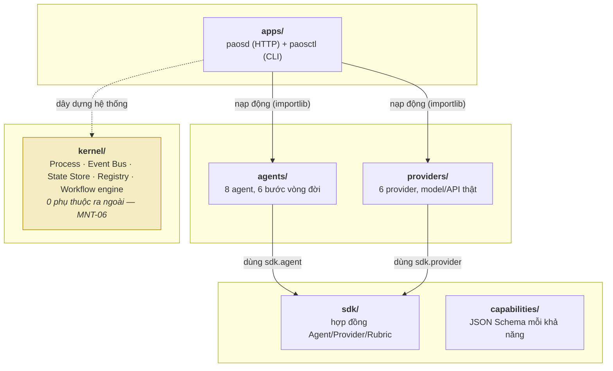
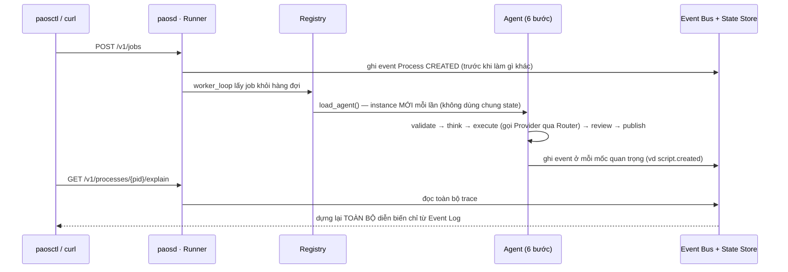
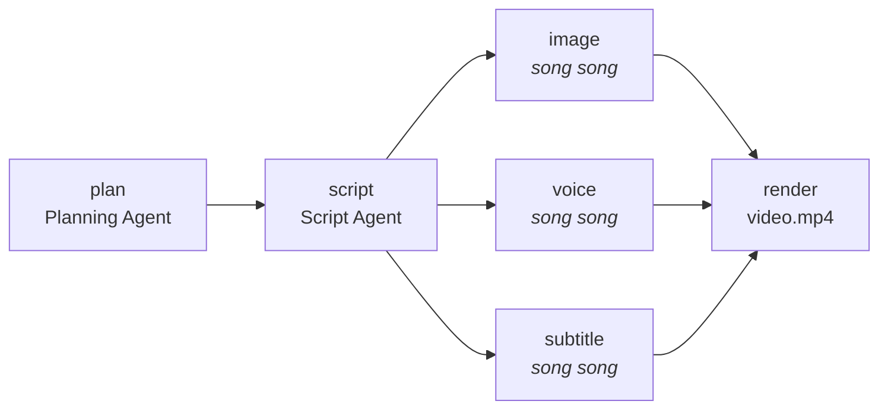
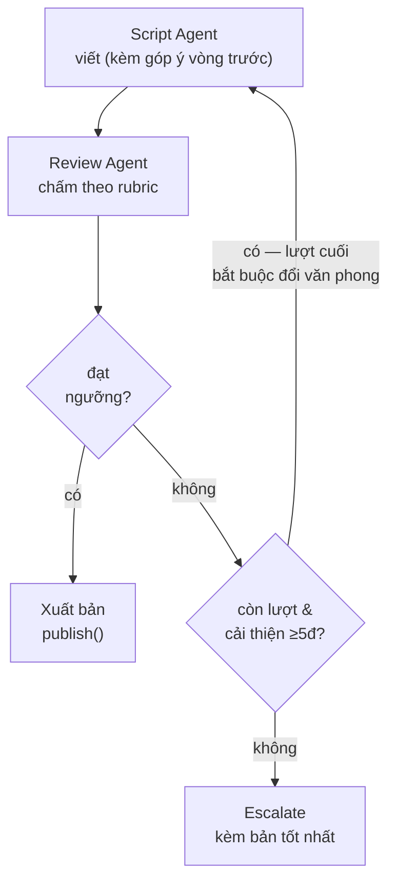

# Hướng dẫn sử dụng & Luồng dự án

> Tài liệu SỐNG — cập nhật mỗi khi có chức năng mới (P-CLOSE của mỗi lát cắt), không phải ảnh chụp một lần. Khác với `docs/00-20` (đặc tả thiết kế, ổn định), file này mô tả **thực trạng chạy được hôm nay**, cùng nhóm với `docs/backlog.md`/`docs/environment-baseline.md`. Cập nhật gần nhất: lát cắt **P-M4-3** (2026-08-16) — **M4 hoàn tất**.

---

## Tài liệu 1 — Hướng dẫn sử dụng hệ thống

PAOS là một "hệ điều hành AI cá nhân" chạy trên máy của chính bạn (local-first) — nhận yêu cầu bằng ngôn ngữ tự nhiên/API, tự lên kế hoạch, tự gọi đúng công cụ (LLM, tạo ảnh, giọng nói...), tự chấm điểm kết quả, và luôn giải thích được vì sao nó quyết định như vậy.

### 1.1 Cài đặt & khởi động

```bash
pip install -e ".[dev]"   # 1 lần, cài paosd/paosctl vào PATH
```

```bash
# Terminal 1 — chạy daemon nền, cổng 127.0.0.1:8787
paosd

# Terminal 2 — kiểm tra + dùng thử
paosctl doctor
# ✓ paosd OK tại http://127.0.0.1:8787
```

### 1.2 Những gì dùng được hôm nay

**Tóm tắt văn bản**
```bash
paosctl run "Dán văn bản cần tóm tắt vào đây..."
paosctl explain 1001   # xem lại toàn bộ diễn biến
```

**Sản xuất video ngắn từ 1 câu chủ đề (UC1)** — từ 1 câu chủ đề → tự lên dàn ý → viết lời thoại → tạo ảnh minh hoạ + giọng đọc + phụ đề (chạy song song) → ghép thành video. Đo được tiết kiệm thời gian nhờ chạy song song, tự chuyển "chế độ nhẹ" khi máy không có GPU thay vì crash (LOC-05).
```bash
curl -X POST localhost:8787/v1/jobs -d '{"intent":"video","spec":{"text":"MongoDB là gì"},"workflow_ref":"workflow:video.plan_and_script@3"}'
```

**Tự chấm điểm & tự sửa kịch bản trước khi dùng (mới — M4)** — kịch bản được chấm theo rubric (đúng độ dài, không lặp ý, mở đầu cuốn hút, đúng tone, có kêu gọi hành động...). Điểm thấp → tự viết lại kèm góp ý, tối đa 3 lần, lần cuối bắt buộc đổi văn phong. Vẫn không đạt → báo người dùng kèm bản tốt nhất, không bao giờ trả tay trắng.
```bash
curl -X POST localhost:8787/v1/jobs -d '{"intent":"video","spec":{"plan":"..."},"workflow_ref":"workflow:script_with_review@1"}'
```

**Ghi lại khi bạn tự tay sửa kết quả AI (mới — M4)** — chỉ số đáng tin nhất theo doc 08 §5 không phải điểm rubric, mà là bạn phải sửa tay BAO NHIÊU. Sửa xong, nộp lại để hệ thống đo `edit_rate` khách quan (không tự khai).
```bash
paosctl artifact show <artifact_id>              # xem nội dung, tự sửa trong editor riêng
paosctl artifact edit <artifact_id> ban-da-sua.txt  # nộp lại — in ra edit_rate đo được
```

**So sánh chất lượng prompt/provider theo thời gian (mới — M4)** — chạy bộ mẫu chuẩn qua nhiều phiên bản prompt, xuất bảng so sánh điểm/edit_rate/chi phí/độ trễ, tự chặn nếu chất lượng đi xuống trước khi đổi prompt thật (doc 08 §7.5).
```bash
python scripts/run_eval.py --provider ollama   # cần Ollama đang chạy; --provider stub để chỉ thử hạ tầng offline
```

**Theo dõi & giải thích mọi việc đang/đã làm** — không có "log" mù mờ, mọi quyết định dựng lại được đầy đủ từ Event Log.
```bash
paosctl ps                 # liệt kê mọi job
paosctl status <pid>       # trạng thái hiện tại
paosctl explain <pid>      # toàn bộ diễn biến, theo thứ tự thời gian
paosctl cancel <pid>       # hủy 1 job đang chạy, không ảnh hưởng job khác
```

### 1.3 Giới hạn hiện tại — nói thẳng

- **Chưa có giao diện Web/đồ hoạ** (đó là M8). Dùng qua `paosctl` hoặc HTTP trực tiếp; có Swagger UI tự sinh ở `http://127.0.0.1:8787/docs` để thử API không cần viết code.
- **Model LLM thật (Ollama) chưa bật an toàn** — mặc định dùng provider "giả lập xác định" (`stub.deterministic`) để mọi thứ chạy nhanh, offline, kiểm chứng được (xem `docs/backlog.md` BL-004). Kết quả sinh ra hiện KHÔNG phải văn bản do AI thật viết.
- **Cơ chế tự sửa kịch bản (M4) chưa nối vào luồng sản xuất video thật** — mới chạy ở 1 luồng riêng (`workflows/script_with_review/`) để chứng minh cơ chế đúng, chưa thay bước viết kịch bản trong UC1 (BL-009).
- **Eval harness (M4) mới có bộ mẫu nhỏ (6 mẫu)**, chưa phải quy mô 30-50 mẫu đầy đủ (BL-011); `scripts/run_eval.py` cũng chưa cưỡng chế "judge khác provider generator" như luồng production (BL-010).
- **Chưa nhớ sở thích người dùng** (giọng đọc ưa thích, độ dài quen dùng...) — mỗi job độc lập, đó là phạm vi M5.
- **Chưa tự chọn cách làm tốt nhất** (Decision Engine, M6) — workflow phải chỉ định tay qua `workflow_ref`.

### 1.4 Sắp tới

M4 (Quality & Self-Correction) đã hoàn tất. Việc **ngay tiếp theo**: **P-M5-0 — chốt ADR-0015 (vector search + embedding) và ADR-0016 (chiến lược chunking)** trước khi bắt đầu code M5 (Memory & Knowledge — 5 tầng memory, retrieval lai, consolidation hàng đêm, Knowledge Graph, Privacy Filter). Lộ trình đầy đủ ở [§3](#3-lộ-trình-sắp-tới) bên dưới.

---

## Tài liệu 2 — Luồng dự án: kiến trúc & sơ đồ

4 sơ đồ dưới trả lời: hệ thống chia tầng ra sao, 1 yêu cầu đi qua đâu, video được ráp bằng DAG nào, và kịch bản tự sửa lặp thế nào. Vẽ đúng cơ chế thật trong code.

**4 nguyên tắc chi phối mọi sơ đồ dưới đây** (doc 00 §5):
- **P1** — Kernel không biết gì về AI: không 1 từ "prompt"/"model" nào trong `kernel/`.
- **P3** — Capability trước Provider: Agent chỉ biết "cần khả năng gì", không biết ai phục vụ.
- **P4** — Mọi thứ liên lạc qua Event: không tầng nào gọi thẳng tầng khác để "biết kết quả".
- **P5** — Explainable by default: Event Log là nguồn sự thật DUY NHẤT.

### 2.1 Sơ đồ 1 — Kiến trúc 4 tầng

Tầng trên được phép "biết" tầng dưới, không bao giờ ngược lại — cưỡng chế thật bằng CI (`import-linter`, `.importlinter`), không phải quy ước suông.



Agent/Provider mới thêm vào chỉ cần 1 file + 1 YAML, `kernel/` nạp động qua `importlib`, không sửa code tầng trên.

### 2.2 Sơ đồ 2 — 1 yêu cầu đi qua hệ thống như thế nào

Mọi bước đều ghi Event TRƯỚC KHI làm bước tiếp theo — kể cả nếu tắt máy giữa chừng, khởi động lại không mất dấu (P9 idempotent & resumable).



### 2.3 Sơ đồ 3 — DAG sản xuất video (UC1)

3 nhánh giữa chạy THẬT SỰ song song (không phải giả lập) — `explain` đo và ghi lại số mili-giây tiết kiệm được so với chạy tuần tự.



Thêm Subtitle Agent (nhánh thứ 3) vào sau không sửa 1 dòng nào của Planning/Script Agent đã có — bằng chứng P4 (loose coupling), kiểm bằng diff git thật (P-M3-4).

### 2.4 Sơ đồ 4 — Vòng lặp tự sửa kịch bản (M4)

Đúng 5 quy tắc chống lặp vô ích (doc 08 §4): tối đa 3 lần thử, phải cải thiện ≥5 điểm giữa 2 vòng liền nhau (không thì dừng sớm), lần cuối bắt buộc đổi văn phong, luôn escalate kèm bản tốt nhất.



Judge (Review Agent) luôn bị cưỡng chế dùng provider KHÁC provider đã viết kịch bản (`Router.call(..., exclude_provider=...)`) — chống việc model tự khen bài của chính nó (ADR-0008, RSK-10).

### 2.5 Vì sao mọi thứ đều là Event

Event Bus không phải chi tiết kỹ thuật phụ — nó LÀ xương sống. Process, Task, Agent, Provider, Router đều chỉ giao tiếp bằng cách **ghi 1 sự kiện** (vd `script.created`, `quality.review.rejected`) rồi để bên khác tự đọc, không gọi thẳng nhau chờ kết quả. Hệ quả trực tiếp: tắt máy giữa chừng khởi động lại không mất dấu vết (đã kiểm bằng test `kill -9`), và `explain` luôn giải thích được MỌI quyết định mà không cần thêm 1 dòng code logging nào — vì bản thân quyết định ĐÃ LÀ 1 event.

---

## 3. Lộ trình sắp tới

Theo kế hoạch 10 milestone (~31 tuần lập trình thuần, 11–15 tháng làm bán thời gian, [doc 13](13-roadmap-and-milestones.md)). Mỗi milestone đều phải cho ra thứ CHẠY ĐƯỢC thật, không có milestone nào chỉ "xây hạ tầng".

| # | Tên | Kết quả dùng được | Trạng thái |
|---|---|---|---|
| M0 | Walking Skeleton | Chạy 1 job đơn giản end-to-end | ✅ Xong |
| M1 | Kernel thật | Process quản lý được, resume được | ✅ Xong |
| M2 | Capability & Provider | Đổi provider không sửa code | ✅ Xong |
| M3 | Agent & Workflow | Video plugin chạy hoàn chỉnh | ✅ Xong |
| M4 | Quality & Self-Correction | Tự sửa, tự chấm điểm, ghi `edit_rate` | ✅ Xong |
| M5 | Memory & Knowledge | Nhớ sở thích, xây Knowledge Graph | ⚪ Kế tiếp |
| M6 | Decision Engine | Tự chọn workflow phù hợp | ⚪ Chưa tới |
| M7 | Cost / Energy / Time | Chạy đêm, tiết kiệm, đúng ngân sách | ⚪ Chưa tới |
| M8 | Plugin System & UI | Cài plugin, có giao diện Web thật | ⚪ Chưa tới |
| M9 | Research Plugin | Nghiên cứu chủ đề, tích luỹ tri thức thật | ⚪ Chưa tới |
| — | Hardening | Đạt toàn bộ chỉ tiêu chất lượng phi chức năng | ⚪ Liên tục |

---

*Xem thêm: [`docs/backlog.md`](backlog.md) (nợ kỹ thuật đang theo dõi) · [`docs/13-roadmap-and-milestones.md`](13-roadmap-and-milestones.md) (exit criteria đầy đủ từng milestone) · dashboard tiến độ (Claude Artifact, cập nhật mỗi lát cắt).*
